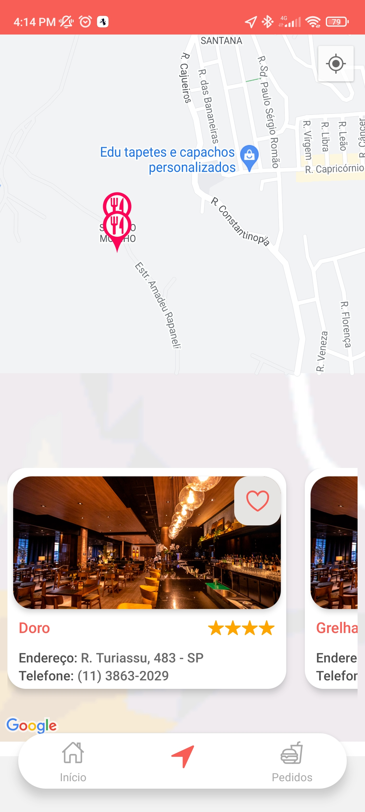
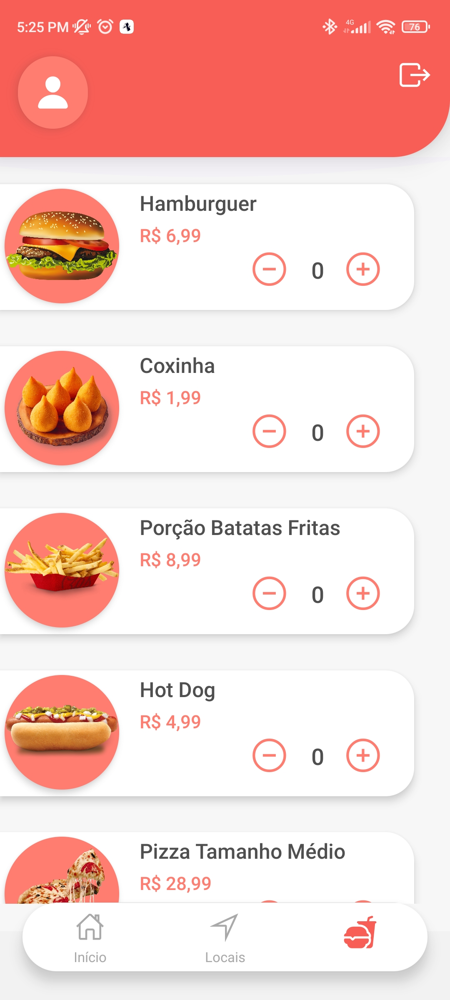
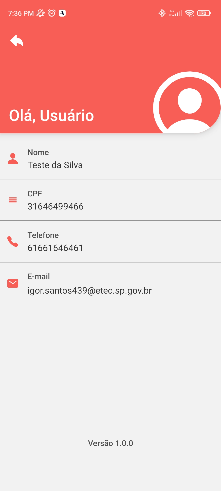
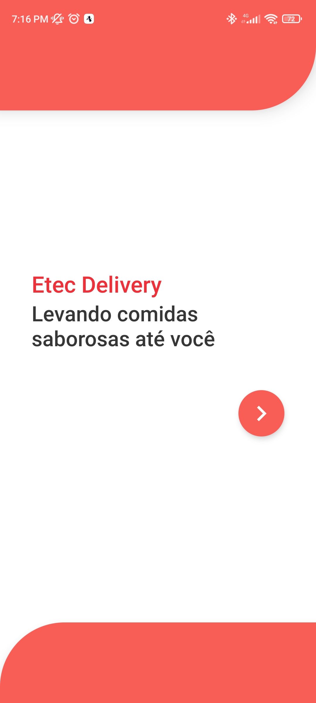
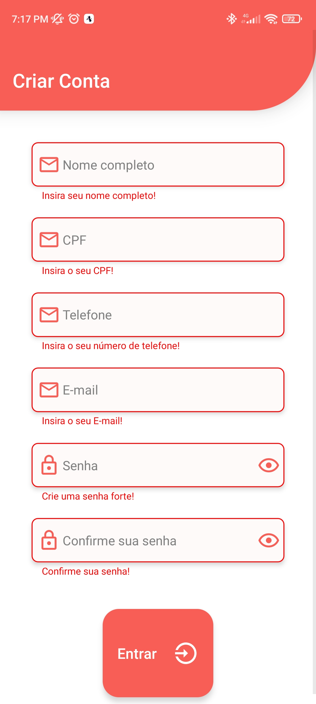

## Etec Delivery

* Projeto em React Native criado para ensino na <a href="https://www.vestibulinhoetec.com.br/unidades-cursos/escola.asp?c=200">Etec Profª Ermelinda Giannini Teixeira</a>
* A ideia da criação do projeto é exemplificar o uso de mapas e de diferentes tipos navegação entre telas com React Native.
* Para a contrução do projeto foi utilizado o <a href="https://docs.expo.dev/workflow/expo-cli/">Expo CLI</a>.
   * Para executar o projeto, execute antes os seguintes comandos:
    * Para instalar o expo-cli globalmente na versão 6.0.1
    > npm install -g expo-cl i@6.0.1

    * Navegue até a pasta do projeto e executa o seguinte comando para instalar todos os pacotes e dependências necessários:
    > yarn install

    * Para atualizar o Expo SDK para a versão 45.0.0
    > expo upgrade 45

    
    
    
    
    
    
    

